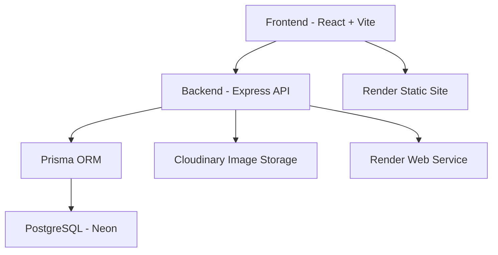
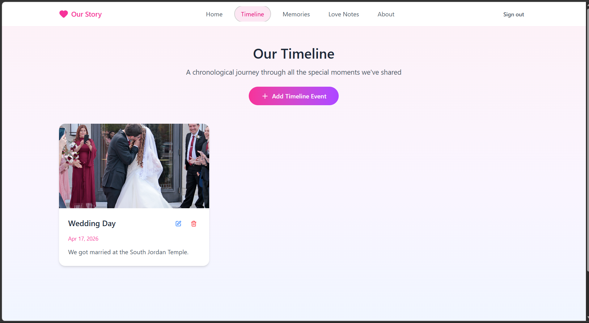
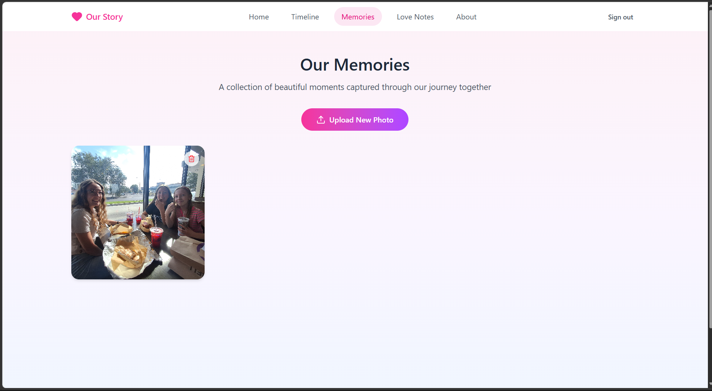
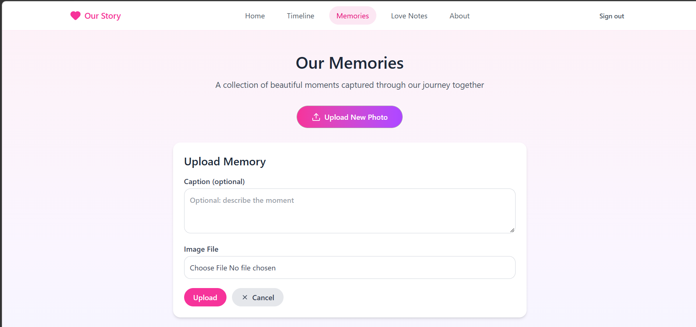

# Our Story App

## Full-Stack Relationship Timeline

Our Story App is a full-stack web application for couples to capture, preserve, and celebrate shared memories. Users can create timeline entries, upload photos, and revisit meaningful moments through a clean, responsive interface.

Built as a personal project for my wife, Our Story App blends emotional storytelling with production-grade engineering.

## Live Demo

- Frontend: https://our-story-app-i80c.onrender.com/
- Backend API: https://our-story-backend-wsog.onrender.com

## Features

- 📝 Create timeline memories with a title, date, description, and optional image
- 📷 Upload images to Cloudinary for timeline events and memories
- 🗂 Browse timeline events, love notes, and memory photos dynamically
- 🔐 JWT authentication with protected content routes
- ⚡ Responsive React frontend built with Vite
- 🗄 Express API backed by Prisma and PostgreSQL
- 🗃 Neon PostgreSQL database with Prisma migrations
- ☁️ Render deployment for the frontend and backend
- 📡 Health checks through `GET /health`
- 🎨 Loading states, image previews, toast notifications, and smooth card transitions

## 🧱 Tech Stack

### Frontend

- React with Vite
- React Hooks
- React Hot Toast
- Fetch API
- Tailwind CSS and custom styling

### Backend

- Node.js
- Express.js
- Prisma ORM
- Multer and Cloudinary image uploads
- JWT authentication
- Zod request validation
- CORS and environment variables
- Express rate limiting for login attempts

### Database

- PostgreSQL hosted on Neon
- Prisma migrations
- Direct Neon connection for migrations
- Pooled Neon connection for runtime queries

### Deployment

- Render Web Service for the backend
- Render Static Site for the frontend
- Automatic SSL through Render
- Render health checks

## 🏗 Architecture Overview



## 📚 API Documentation

Protected endpoints require an `Authorization: Bearer <token>` header.

### Health

#### `GET /health`

Returns `200 OK` when the backend process is running.

### Authentication

#### `POST /auth/register`

Create a user account.

```json
{
	"email": "you@example.com",
	"password": "your-password"
}
```

#### `POST /auth/login`

Authenticate and receive a JWT.

```json
{
	"email": "you@example.com",
	"password": "your-password"
}
```

### Timeline

#### `GET /timeline`

Fetch timeline events for the authenticated user.

#### `POST /timeline`

Create a timeline event.

```json
{
	"title": "Our Wedding Day",
	"date": "Jun 15, 2024",
	"description": "The happiest day of our lives.",
	"imageUrl": "https://res.cloudinary.com/example/image/upload/wedding.jpg"
}
```

The timeline also supports `PUT /timeline/:id` and `DELETE /timeline/:id`.

### Love Notes

- `GET /lovenotes`
- `POST /lovenotes`
- `PUT /lovenotes/:id`
- `DELETE /lovenotes/:id`

### Memory Photos

- `GET /memories/photos`
- `POST /memories/photos`
- `PUT /memories/photos/:id`
- `DELETE /memories/photos/:id`

### Image Uploads

#### `POST /uploads`

Upload an image using `multipart/form-data` with:

- `file`: image file
- `folder`: `timeline` or `memories`

The response includes the Cloudinary `fileUrl`, which can be saved with the related timeline or photo record.

## 🖼 Screenshots

Screenshots captured from the deployed frontend:

### Timeline view



### Memories view



### Memory upload form




## 🛠 Local Development Setup

### 1. Clone the repository

```bash
git clone https://github.com/Samigu8/Our-Story-App.git
cd Our-Story-App
```

### 2. Install backend dependencies

```bash
cd backend/node
npm install
```

### 3. Configure backend environment variables

Create `backend/node/prisma/.env`:

```env
DATABASE_URL=your-pooled-neon-url
DIRECT_DATABASE_URL=your-direct-neon-url
JWT_SECRET=your-secret
CLOUDINARY_CLOUD_NAME=your-cloud-name
CLOUDINARY_API_KEY=your-api-key
CLOUDINARY_API_SECRET=your-api-secret
```

Run migrations when needed:

```bash
npm run migrate
```

### 4. Start the backend

```bash
npm start
```

The API runs on `http://localhost:3000` by default and respects the `PORT` environment variable.

### 5. Install and configure the frontend

```bash
cd ../../frontend
npm install
```

The frontend uses Vite environment variables. For local development, set:

```env
VITE_API_URL=http://localhost:3000
```

For production, use:

```env
VITE_API_URL=https://our-story-backend-wsog.onrender.com
```

### 6. Start the frontend

```bash
npm run dev
```

### 7. Build for production

```bash
npm run build
```

The Vite production bundle is written to `frontend/dist/`.

## Render Deployment

### Backend Web Service

- Root directory: `backend/node`
- Build command: `npm install`
- Start command: `npm start`
- Optional pre-deploy command: `npm run migrate`
- Health check path: `/health`

Configure `DATABASE_URL`, `DIRECT_DATABASE_URL`, `JWT_SECRET`, and the Cloudinary variables in Render's environment settings. Never commit `prisma/.env`.

### Frontend Static Site

- Root directory: `frontend`
- Build command: `npm install && npm run build`
- Publish directory: `dist`
- Environment variable: `VITE_API_URL=https://our-story-backend-wsog.onrender.com`

## 🔒 Security and Stability

- Secrets are loaded through environment variables and excluded from Git
- Prisma uses separate direct and pooled database connections
- JWT middleware protects private routes
- Zod validates request payloads
- Login attempts are rate-limited
- Render health checks monitor backend availability
- Centralized error handling returns safe API responses
- Cloudinary stores uploaded images outside the application server

## 📈 Future Improvements

- Public read-only story mode
- Email notifications for new memories
- Mobile or PWA version
- AI-assisted memory descriptions
- Relationship milestone tracking
- Additional cloud storage options such as S3 or Cloudflare R2

## ❤️ Why I Built This

I created Our Story App for my wife as a way to preserve our memories, from small everyday moments to major milestones. The project became an opportunity to learn how to architect a full-stack system, deploy and maintain real services, handle image uploads securely, and design meaningful user experiences.

## 👨‍💻 Author

**Samuel Gutiérrez**  
Full-Stack Developer  
Salt Lake City, UT
