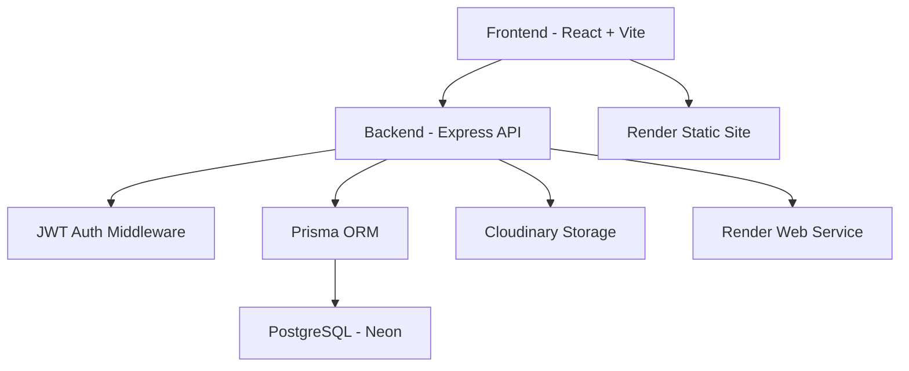

# 🏗 System Architecture Overview

Our Story App is a full-stack web application for capturing and revisiting meaningful relationship memories. The application combines a React interface, a protected Express API, Prisma persistence, and cloud-hosted services.

## 🧭 High-Level Architecture

## 🧩 Frontend Architecture

- React with Vite for development and production bundling
- React Router for page navigation
- React Context for authentication state
- `localStorage` for the browser JWT session token
- Fetch API for REST communication
- React Hot Toast for success and error feedback
- Responsive Tailwind CSS and custom styling
- Loading states, image previews, and animated timeline cards

The main user-facing pages are:

- `Home`
- `Timeline`
- `Memories`
- `Love Notes`
- `About`
- `Login`

Protected pages redirect unauthenticated users to `/login`. API requests include an `Authorization: Bearer <token>` header.

## 🧩 Backend Architecture

The active backend is the Node.js service in `backend/node`.

- `src/server.js` registers middleware and API routes
- `src/routes/` defines authentication, story, memory, and upload endpoints
- `src/controllers/` contains request and persistence logic
- `src/middleware/` provides JWT auth, Zod validation, upload handling, and rate limiting
- `src/utils/prisma.js` initializes the Prisma PostgreSQL client
- `prisma/` contains the schema, migrations, and local environment configuration

The backend provides:

- JWT registration and login
- Protected timeline, love-note, memory, and upload routes
- Zod request validation
- Login rate limiting
- Cloudinary image uploads
- A database-independent `/health` endpoint for Render monitoring

## 🗄 Database Architecture

Prisma models currently include:

- `User` for account credentials and identity
- `Memory` for authenticated legacy memory records
- `TimelineEvent` for timeline entries
- `LoveNote` for relationship notes
- `Photo` for uploaded memory metadata

Timeline and note dates are stored as formatted strings such as `Apr 17, 2026`, matching the frontend validation rules.

### Connection Strategy

- `DIRECT_DATABASE_URL` is used by Prisma CLI migrations
- `DATABASE_URL` is used by the runtime Prisma client
- Both connection strings are stored as deployment environment variables
- Local credentials belong in `backend/node/prisma/.env`, which must never be committed

## ☁️ Deployment Architecture

### Backend

- Render Web Service
- Root directory: `backend/node`
- Build command: `npm install`
- Start command: `npm start`
- Migration command: `npm run migrate`
- Health check: `GET /health`

### Frontend

- Render Static Site
- Root directory: `frontend`
- Build command: `npm install && npm run build`
- Publish directory: `dist`
- API configuration: `VITE_API_URL`

### External Services

- Neon provides PostgreSQL hosting
- Cloudinary stores uploaded images
- Render provides hosting, TLS, deploys, and health monitoring
